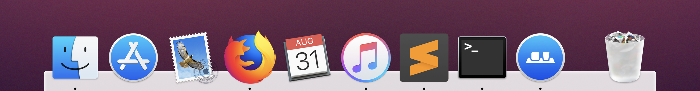
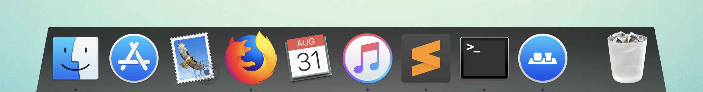
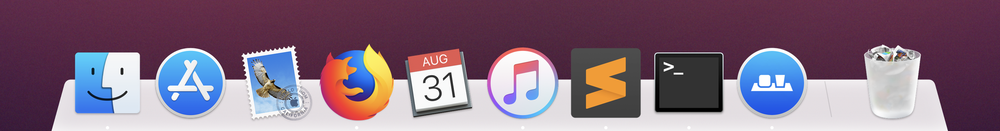

# cDock Themes

Some retina ready themes for [cDock 3](https://www.macenhance.com/cdock.html) (a dock customization app for macOS 10.10 and above).

## Installation

Move the theme folders to `~/Library/Application Support/cDock/themes/` and restart cDock. You can open the `themes` folder by clicking the button *Show* in the cDock customization window. You can also open it by using the *Go to Folder...* menu item in Finder under the *Go* menu.

**Note**: In order to open the library folder directly you have to show hidden files.

## Themes

**10.5 - Leopard**

Inspired by the default dock from Mac OS X Leopard (version 10.5).

**Black Glass**

**Brushed Metal**

**Elementary**

Inspired by the default dock Plank from [elementary OS](https://elementary.io/).

**Graphite Bar**

**Graphite Bar (Light)**

/preview-dark.png)

**Pantherophis**

**Pantherophis Bar**

**Snow**

## License

This project is open source licensed under the BSD 3-Clause License. Please see the [LICENSE file](LICENSE) for more information.