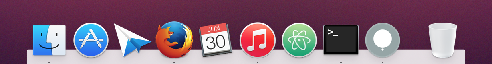
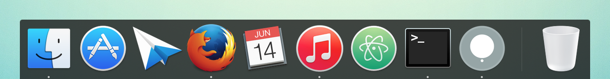
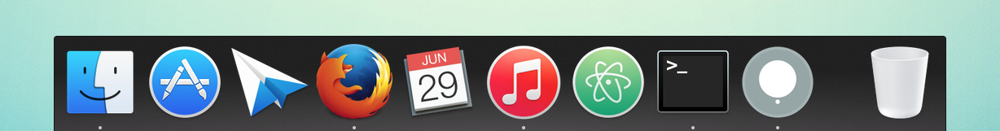
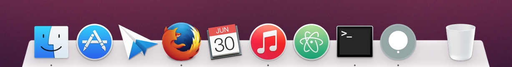

# cDock Themes

Some themes for [cDock 2](http://w0lfschild.github.io/app_cDock.html) (a dock customization app for OS X 10.9 and above).

## Installation

Move the theme folders to `~/Library/Application Support/cDock/themes/` and restart cDock. You can open the `themes` folder by Using the *Go to Folder...* menu item in Finder under the *Go* menu.

**Note**: To navigate the Library folder in Finder directly you have to show hidden files.

## Themes

**Elementary**

Inspired by the default dock Plank of [elementary OS](https://elementary.io/).

**Graphite**

**Graphite (Light)**

/preview_light.png)

**Graphite Bar**

**Graphite Bar (Light)**

/preview_light.png)

**Pantherophis**

**Pantherophis Bar**

**Snow**

## License

This work is licensed under the Creative Commons Attribution 4.0 International License. To view a copy of this license, visit <http://creativecommons.org/licenses/by/4.0/> or send a letter to Creative Commons, PO Box 1866, Mountain View, CA 94042, USA.